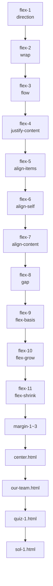

# 11장 Flexbox 실습 가이드

이 문서는 `11` 폴더에 있는 플렉스 박스 실습 파일들을 한눈에 정리한 자료입니다. 각 파일에서 실습할 핵심 속성 위치를 라인 번호와 함께 기록했습니다.

## 실습 파일 목록
| 파일 | 주요 포인트 | 참고 라인 |
| --- | --- | --- |
| **flex-1.html** | `flex-direction` 값 비교 | [results/flex-1.html#L31-L43](results/flex-1.html#L31-L43) |
| **flex-2.html** | `flex-wrap` 줄바꿈 옵션 | [results/flex-2.html#L31-L39](results/flex-2.html#L31-L39) |
| **flex-3.html** | `flex-flow` 단축 속성 | [results/flex-3.html#L31-L35](results/flex-3.html#L31-L35) |
| **flex-4.html** | `justify-content` 정렬 | [results/flex-4.html#L31-L43](results/flex-4.html#L31-L43) |
| **flex-5.html** | `align-items` 정렬 | [results/flex-5.html#L33-L47](results/flex-5.html#L33-L47) |
| **flex-6.html** | 개별 `align-self`, `flex-grow` | [results/flex-6.html#L33-L39](results/flex-6.html#L33-L39) |
| **flex-7.html** | `align-content` 값 실험 | [results/flex-7.html#L35-L51](results/flex-7.html#L35-L51) |
| **flex-8.html** | `gap` 속성 적용 | [results/flex-8.html#L8-L17](results/flex-8.html#L8-L17) |
| **flex-9.html** | `flex-basis` 지정 | [results/flex-9.html#L15-L21](results/flex-9.html#L15-L21) |
| **flex-10.html** | `flex-grow` 비율 | [results/flex-10.html#L28-L35](results/flex-10.html#L28-L35) |
| **flex-11.html** | `flex-shrink` 비율 | [results/flex-11.html#L29-L40](results/flex-11.html#L29-L40) |
| **margin-1.html** | 첫 항목만 시작점 배치 | [results/margin-1.html#L30-L38](results/margin-1.html#L30-L38) |
| **margin-2.html** | 마지막 항목 끝점 배치 | [results/margin-2.html#L32-L34](results/margin-2.html#L32-L34) |
| **margin-3.html** | 첫 항목만 위쪽 배치 | [results/margin-3.html#L33-L35](results/margin-3.html#L33-L35) |
| **center.html** | 버튼을 화면 중앙에 배치 | [results/center.html#L8-L28](results/center.html#L8-L28) |
| **our-team.html** | 카드형 팀 소개 레이아웃 | [results/our-team.html#L12-L61](results/our-team.html#L12-L61) |
| **quiz-1.html** | 고양이 갤러리 실습 문제 | [quiz-1.html#L8-L26](quiz-1.html#L8-L26) |
| **sol-1.html** | 실습 완성 예시 | [sol-1.html#L8-L43](sol-1.html#L8-L43) |
| **index.html** | 명언 카드 예제 | [index.html#L10-L24](index.html#L10-L24) |

위 라인 번호는 GitHub에서 파일을 열었을 때 기준이며 주요 속성이 시작되는 위치를 가리킵니다.

## 학습 순서 다이어그램

아래 다이어그램은 실습 파일 진행 순서를 나타냅니다.

각 실습 파일을 차례로 수정하며 Flexbox의 핵심 속성을 익힌 후, 마지막 퀴즈와 예시로 마무리해 보세요.
