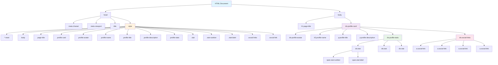

# 미션 2: 프로필 카드 기본 문서

## 소개
HTML과 CSS만으로 작성된 프로필 카드 예제를 설명합니다. 코드 구조와 각 스타일의 역할을 새로 입사한 개발자가 쉽게 이해할 수 있도록 정리했습니다.

## 구조 다이어그램
아래 메르메이드 다이어그램은 문서의 주요 요소와 CSS 클래스를 시각적으로 보여 줍니다.



## HTML 구조
1. **head** – 문서 정보와 스타일 정의를 포함합니다.
2. **body** – 실제 페이지 내용이 들어갑니다.
   1. 페이지 제목(`h1.page-title`): **🎯 미션임파서블 파이널 완성**
   2. 프로필 카드(`div.profile-card`)
      - 원형 아바타(`div.profile-avatar`)
      - 이름(`h2.profile-name`)
      - 직책(`p.profile-title`)
      - 소개글(`p.profile-description`)
      - 통계 영역(`div.profile-stats`)
      - 소셜 링크 모음(`div.social-links`)

## CSS 역할
1. **전역 초기화** – 모든 요소의 `margin`, `padding`을 0으로 리셋하고 `box-sizing`을 `border-box`로 지정합니다.
2. **페이지 배경 및 기본 글꼴** – 그라데이션 배경과 시스템 폰트를 적용해 전체적인 분위기를 잡습니다.
3. **프로필 카드** – 흰색 배경, 둥근 모서리, 그림자와 호버 애니메이션을 부여합니다.
4. **아바타** – 원형 크기, 그라데이션 배경, 흰색 테두리와 그림자를 설정합니다.
5. **텍스트 요소** – 이름, 직책, 설명 각각의 크기와 색상을 조절하여 계층을 만듭니다.
6. **통계 영역** – 상단 테두리와 함께 `inline-block`을 이용해 통계 항목을 가로로 배치합니다.
7. **소셜 링크** – 원형 버튼 형태로 배경과 색을 바꾸며 호버 시 이동 효과를 줍니다.

## 핵심 기능 정리
- **카드 호버 애니메이션**: 마우스 오버 시 카드가 살짝 위로 올라오며 그림자가 짙어집니다.
- **통계 영역 레이아웃**: `inline-block`을 사용해 세 개의 통계가 한 줄에 표시됩니다.
- **버튼 호버 효과**: 소셜 링크 아이콘은 호버 시 배경색이 브랜드 컬러로 변하면서 약간 위로 이동합니다.
- **통계 숫자 호버 효과**: `.stat:hover .stat-number` 규칙 덕분에 통계 숫자가 보라색(`#764ba2`)으로 바뀌고 약간 확대됩니다.
```css
.stat:hover .stat-number {
    color: #764ba2;
    transform: scale(1.1);
}
```
- **반응형 너비**: 카드의 `max-width`를 지정해 작은 화면에서도 적절히 줄어듭니다.

## 실습 팁
- CSS 값을 변경해 다양한 색상과 글꼴을 시험해 보세요.
- 통계 항목을 추가하거나 아이콘을 다른 이미지로 교체해 기능을 확장해 볼 수 있습니다.
- 코드를 분리하여 외부 CSS 파일로 관리하면 유지보수가 한층 쉬워집니다.

HTML 예제와 동일하게 적용하면 위와 같은 프로필 카드를 완성할 수 있습니다.
