# 저장소 사용 가이드

이 문서는 도서 **"HTML/CSS/JavaScript"** 예제 저장소의 디렉터리 구성을 간략히 정리한 것입니다. 각 장별 폴더는 예제를 직접 실행하며 학습할 수 있도록 꾸며져 있으며, `pr` 폴더에는 프로젝트 실습이 포함되어 있습니다.

## 폴더 요약

| 폴더 | 내용 |
| --- | --- |
| **02** | HTML 기본 구조와 첫 번째 예제 페이지 |
| **03** | 주석, 기본 태그, 이미지 폴더 구조 예제 |
| **04** | 멀티미디어 요소와 시맨틱 태그 연습 |
| **05** | 입력 폼과 다양한 폼 컨트롤 |
| **06** | CSS 기본 문법과 선택자 실습 |
| **07** | 글꼴, 색상, 목록 등 텍스트 스타일링 |
| **08** | 박스 모델, 테두리, 그림자 속성 |
| **09** | 배경 이미지와 그라디언트 효과 |
| **10** | 반응형 레이아웃과 단위 활용 |
| **11** | Flexbox 레이아웃 기초 |
| **12** | CSS Grid 레이아웃 실습 |
| **13** | 고급 선택자와 의사 클래스 |
| **14** | CSS 애니메이션과 변환 효과 |
| **15** | 자바스크립트 기초 구문 |
| **16** | 조건문과 반복문 기본 |
| **17** | 함수와 이벤트 처리 |
| **18** | 배열과 날짜 객체 등 기본 객체 |
| **19** | DOM 조작과 동적 페이지 작성 |
| **pr** | 단계별 실습 프로젝트(`lab-step1` ~ `lab-step6`) |

## 사용 팁

1. 각 폴더에서 `index.html`(또는 주요 예제 파일)을 브라우저로 열어 보며 실습해 보세요.
2. `pr` 폴더는 단계별로 구성되어 있으니 `lab-step1`부터 순서대로 따라가며 코드를 확인하면 학습 효과가 좋습니다.
3. 예제를 수정한 뒤 브라우저를 새로 고쳐 결과를 확인하면서 학습해 보세요.

## 저장소 개요 다이어그램

```mermaid

flowchart LR
    subgraph "Chapters"
        C02["02"] --> C03["03"] --> C04["04"] --> C05["05"] --> C06["06"] --> C07["07"] --> C08["08"] --> C09["09"] --> C10["10"] --> C11["11"] --> C12["12"] --> C13["13"] --> C14["14"] --> C15["15"] --> C16["16"] --> C17["17"] --> C18["18"] --> C19["19"]
    end
    C19 --> PR["pr"]
    subgraph "pr"
        Step1["lab-step1"] --> Step2["lab-step2"] --> Step3["lab-step3"] --> Step4["lab-step4"] --> Step5["lab-step5"] --> Step6["lab-step6"]
    end
    PR --> Step1
```

